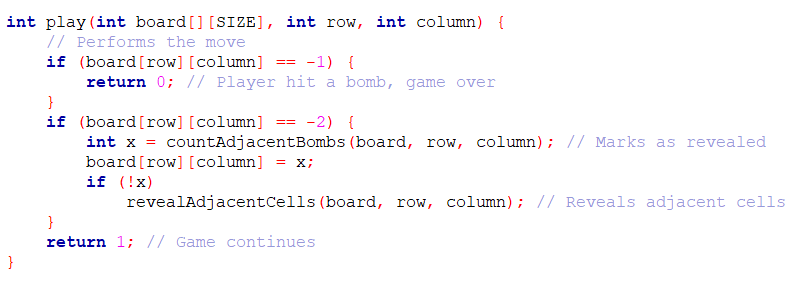
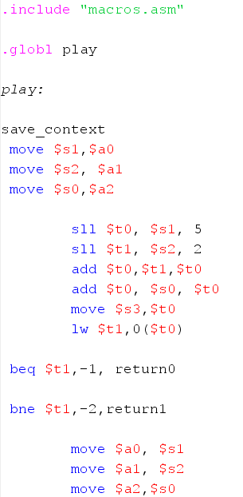
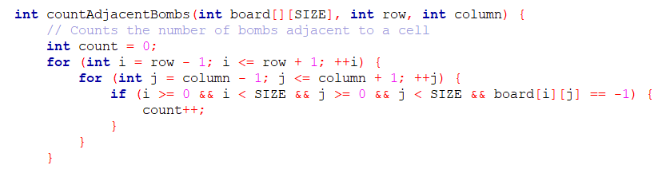
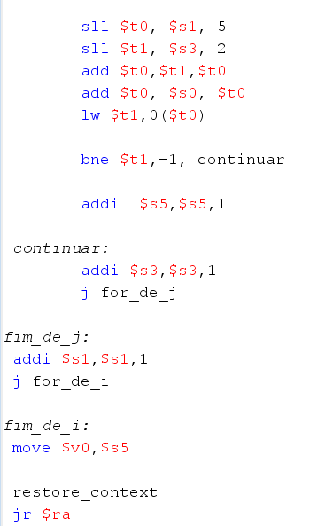

# Minesweeper-in-MIPS
## Trabalho Minesweeper em MIPS
 Esse trabalho foi realizado pela dupla Luana Teles e Stefani Rodrigues. Neste arquivo iremos explicar as configurações, a execusão e outras coisas do projeto.
 
## Sumario
- [Play](#Play)
- [countAdjacentBombs](#countAdjacentBombs)
- [revealAdjacentCells](#revealAdjacentCells)
- [checkVictory](#checkVictory)

### Play
A funçao Play é responsavel pela execução das jogadas efetuadas pelo jogador. Ela analiza a coodenada dada pelo jogador, por meio do numero da linha [row] e da coluna [column] fornecida pelo mesmo, e verifica se uma bomba foi atingida. Se esse for o caso, a função encerra o jogo e o jogador perde. Se nenhuma bomba foi atingida, então o jogo continua sendo executado.

Ambas as funções utilizam a matriz do tabuleiro e as coordenadas dadas pelo jogador no main.

Durante sua execussão ela chama mais duas funções o countAdjacentsBombs e o revealNeighboringCells 

ao fim as duas retornam 1 quando nenhuma bomba é atingida

### countAdjacentBombs
Essa função é responsavel pela, comoo seu proprio nome diz, contagem de bombas adjacentes à coordenada escolhida pelo jogador. A countAdjacentsBombs só irá ser executada se a coordenada escolhida pelo jogador não tiver uma bomba. Ela auxilia o jogador a saber qual deve ser sua próxima rodada.

Com a utilização de loops para percorrer o tabuleiro, a função realiza a checagem das celas ao redor da coordenada escolhida para a contagem de bombas vizinhas. Ao encontrar uma bomba o contador é incrementado.

