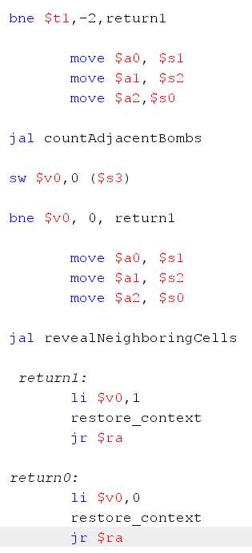

# Minesweeper-in-MIPS
## Trabalho Minesweeper em MIPS
 Esse trabalho foi realizado pela dupla Luana Teles e Stefani Rodrigues. Neste arquivo iremos explicar as configurações, a execução e outras coisas do projeto.
 
## Sumario
- [Play](#Play)
- [countAdjacentBombs](#countAdjacentBombs)
- [revealAdjacentCells](#revealAdjacentCells)
- [checkVictory](#checkVictory)

### Play
A função Play é responsável pela execução das jogadas efetuadas pelo jogador. Ela analisa a ordem dada pelo jogador, por meio do número da linha [row] e da coluna [column] fornecida pelo mesmo, e verifica se uma bomba foi atingida. Se esse for o caso, a função encerra o jogo e o jogador perde. Se nenhuma bomba foi atingida, então o jogo continua sendo executado.

Ambas as funções utilizam a matriz do tabuleiro e as coordenadas dadas pelo jogador no main.

Durante sua execução, ela chama mais duas funções, o countAdjacentsBombs e o revealNeighboringCells.

Ao fim, as duas retornam 1 quando nenhuma bomba é atingida.

Conta responsável por encontrar a coordenada dada pelo usuário. 

### countAdjacentBombs
Essa função é responsável pela, como seu próprio nome diz, contagem de bombas adjacentes à coordenada escolhida pelo jogador. A countAdjacentsBombs só irá ser executada se a coordenada escolhida pelo jogador não tiver uma bomba. Ela auxilia o jogador a saber qual deve ser sua próxima rodada.

Com a utilização de loops para percorrer o tabuleiro, a função realiza a checagem das celas ao redor da coordenada escolhida para a contagem de bombas vizinhas. Ao encontrar uma bomba, o contador é incrementado.

A seguir, como se pode ver na imagem, é a criação de um dos loops da função. 

Ela utiliza a linha dada pelo usuário por meio do registrador ($s0) e subtrai, criando assim o contador do primeiro for, o i. Da mesma forma, mas desta vez somando um ao registrador, é criada a restrição do for.
Esse loop só irá parar quando seu i tiver o mesmo valor da restrição.

Por fim, a função devolve o valor da contagem do contador de volta para o main, onde, então, é registrado no print board

### revealAdjacentCells
A função revealAdjacentCells é uma função recursiva, ou seja, ela se auto chama durante sua execução.

Essa função é responsavel por revelar as celas adjacentes a coordenada escolhida pelo jogador, caso a mesma seja uma cela sem nenhuma bomba ao seu redor, por meio do uso de loops.

Utilizando o tabuleiro e as coordenadas dadas pelo jogador, a função chama a função countAdjacentBombs para verificar se ha mais celas adjacentes a escolhia que tambem não possuem bombas ao redor.

Enquanto houver celas sem bombas ao redor da coordenada excolhida a função continuará a se chamar.

### checkVictory
A função checkVictory verifica se o jogador venceu o jogo.

